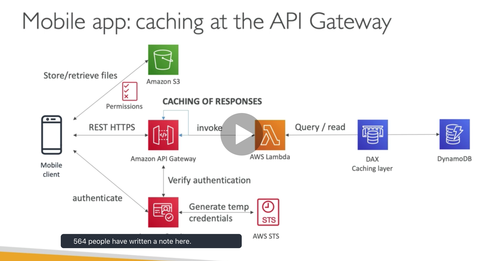
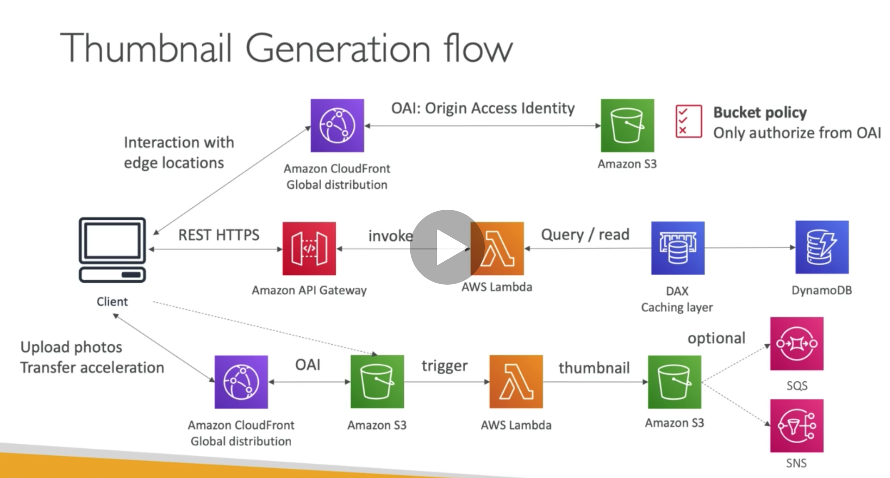
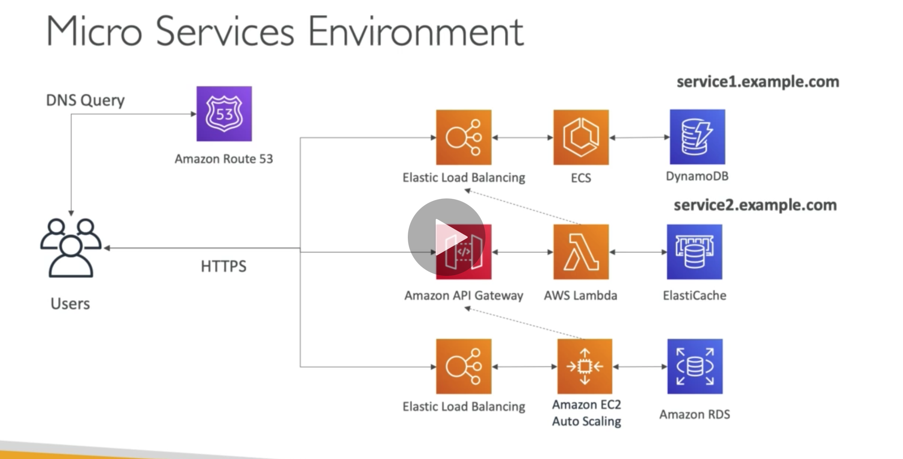
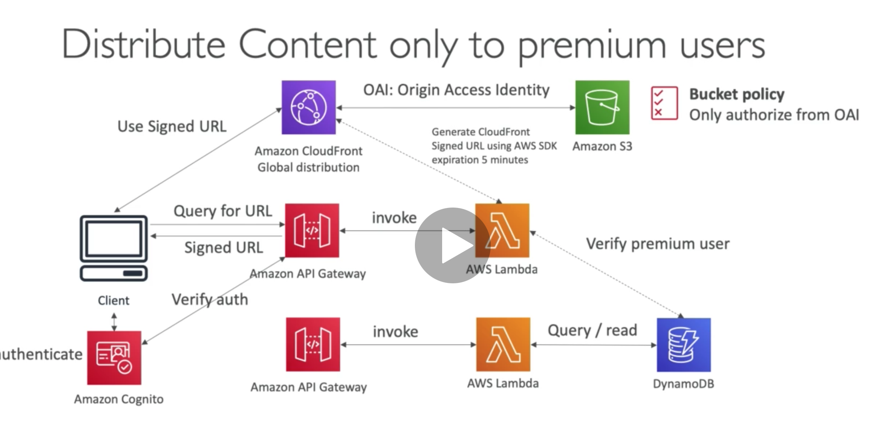
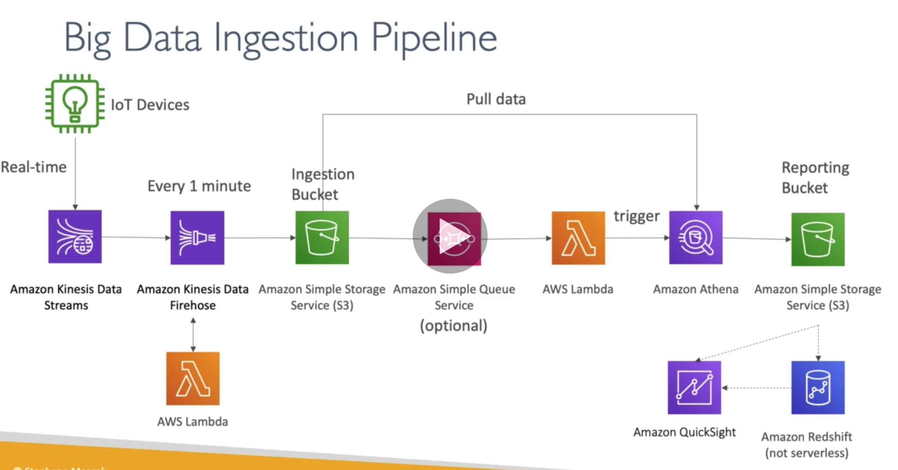

**Serverless**

**Lambda**
* Servers are limited by RAM or  CPU
* Continuously running
* Scaling means adding or removing servers
* With Lambda - we run functions as service. They are short running and are run on demand. They can scale infinitely
* Pricing is very cheap. Pay per request. First 1 million requests per month are free
* Example Use cases
    * Thumbnail creation based on S3 events
    * Cron job based on cloud watch events
* Max 15 mins runtime, Upto 10GB RAM, 4KB env variables
* 50 MB deployment artifact (compressed), 250 MB uncompressed
* Lambda at edge
    * used with cloud front to perform actions on requests at edge locations
    * useful to boost performance
    * deployed globally

**Dynamo DB**
* Serverless no SQL aws proprietary database.
* Multi AZ, fully managed
* scales to massive workloads
* made of tables no dbs with a primary key
* Each row has attributes that are dynamic. max size 400KB.
* RCU read capacity unit and WCU write capacity unit must be specified
* Can set up autoscaling to increase RCU or WCU on demand
* ProvisionedThroughputException if RCU is exceeded without autoscaling setup
* DAX cache for dynamo db. reduces reads and solves the above problem
* Dynamodb Streams data changes can create streams of data which can be read from a lambda
* On Demand Dynamo DB - No need to specify RCU and WCU. more expensive. Helpful when spikes are unpredictable or used rarely
* We can launch a local dynamo db for local development
* Global tables must enable streams, a changelog stream will be created and the data will be replicated in multi regions

**Api gateway**
* serverless REST APIs
* can route requests to lambda functions
* can cache responses
* handle api versioning and environments
* Request throtlling, rate limiting
* Swagger or openapi
* API Keys
* Edge optimized - for global access of apis, Regional and Private.
* Iam permissions can be used to authenticate users before allowing access. (uses Sig V4)
* can integrate with AWS cognito user pools to verify authentication.

**SAM Serverless application model**
* framework for developing and deploying serverless applications
* YAML code
* helps to run lambda, api gateway and dynamo db locally
* can use codedeploy to deploy lambda functions

**Sample Architectures**
* Simple Serverless CRUD application

* Global application

* microservices serverless

* distributed paid content

* big data ingestion pipeline
